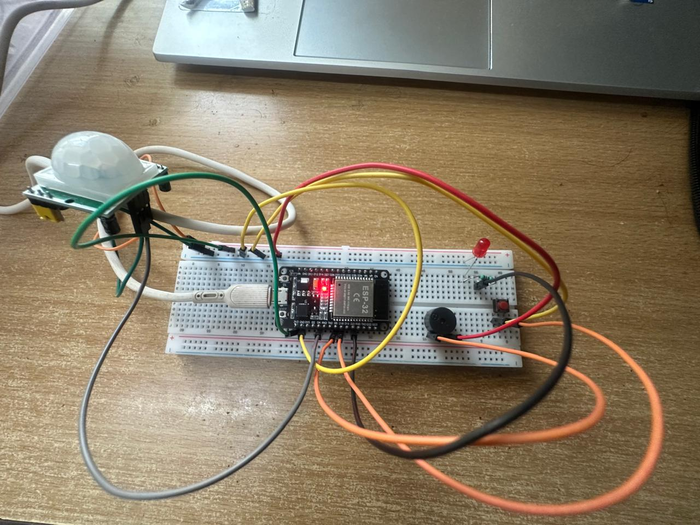
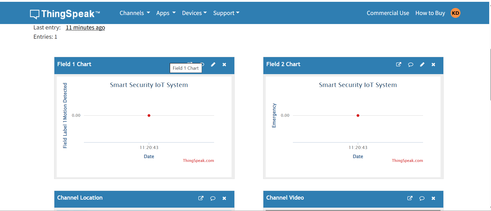
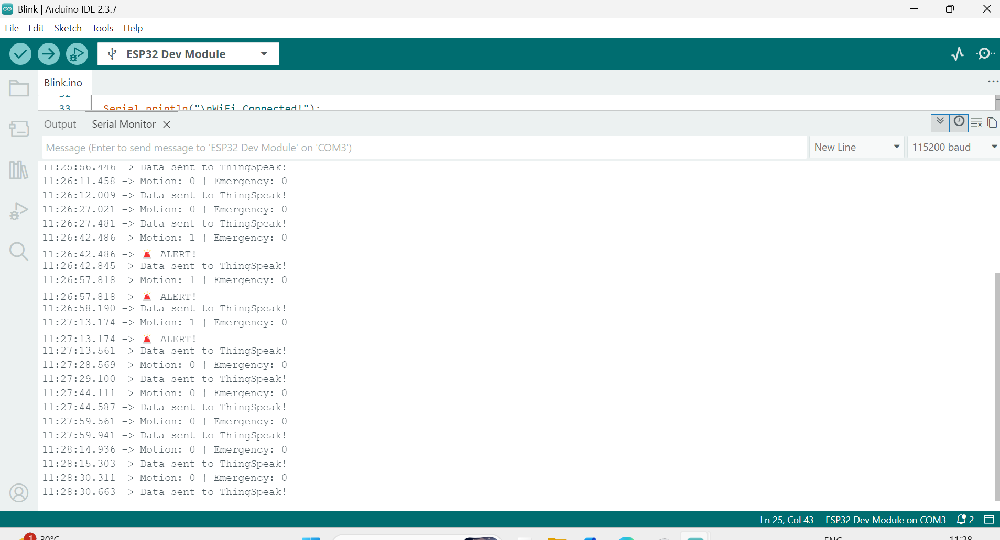

# 🚨 Smart Security IoT System using ESP32

## 📌 Overview
This project is an IoT-based Smart Security System developed using ESP32. It detects motion using a PIR sensor and triggers alerts using LED and buzzer. It also includes a manual emergency button. The system sends real-time data to ThingSpeak cloud for monitoring.

---

## 🚀 Features
- Motion detection using PIR sensor  
- Emergency alert using push button  
- LED and buzzer alert system  
- Real-time cloud monitoring using ThingSpeak  
- WiFi-based IoT system  

---

## ⚙️ Components Used
- ESP32  
- PIR Motion Sensor  
- LED  
- Buzzer  
- Push Button  
- Resistor  
- Breadboard & Jumper wires  

---

## 🔌 Connections

### PIR Sensor → ESP32
- VCC → 5V  
- GND → GND  
- OUT → GPIO 4  

### LED → ESP32
- + → GPIO 21  
- – → GND  

### Buzzer → ESP32
- + → GPIO 5  
- – → GND  

### Push Button → ESP32
- One side → GPIO 18  
- Other side → GND  

---

## 🔧 Working
The ESP32 continuously reads the PIR sensor to detect motion. When motion is detected, LED and buzzer are activated. A push button allows manual emergency triggering.

Data is sent to ThingSpeak cloud:
- Field1 → Motion Detection  
- Field2 → Emergency Alert  

---

## 📷 Prototype

  

---

## 📊 Output Screenshots

### ThingSpeak Output

  

### Serial Monitor Output

  

---

## 🛠️ Technologies Used
- Embedded C  
- Arduino IDE  
- ESP32  
- ThingSpeak  
- IoT  

---

## 📌 Project Status
✔ Completed and working  
✔ Real-time monitoring implemented  

---

## 👨‍💻 Author
Karunakar Reddy D
